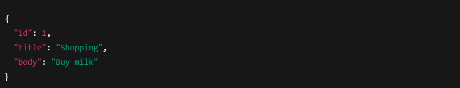

# Notes App

A simple command-line Notes application built using pure Node.js only.
Manage notes through the terminal using operations like add, find remove and list

## Features

- Add a new note
- Find note by title
- Remove a note
- List all notes
- Stores notes in a local notes.json file
- Error-handled using a single global try/catch
- Safe parsing & input validation
- Clean switch-based operation handler

## Project Structure

notes-app
│── index.js
│── notes.json
|── package.json
└── README.md

index.js - main cli script
notes.json - local JSON database storing notes

## How to Use

Run the script: node index.js
Then type your operation when prompted.

## Available Operations

➕ Add a note
add --title="Shopping" --body="Buy milk"

🔍 Find a note
find --title="Shopping"

🗑️ Remove a note
remove --title="Shopping"

📋 List all notes
list

## How It works

- The input is split into an operation flags(--title, --body)
- Notes are stored as objects inside notes.json
- Each note structure:
  
- All file operations use Node's built-in fs/promises
- One global try/catch block handles
  - invalid JSON
  - missing flags
  - missing notes
  - unknown operations
  - file read/write errors

## Notes Format(notes.json)

-Notes are stored as an array:

## How to Run

- Install Node.js(16+ recommended)
- Clone this repository
- Rune the script: node index.js
- When prompted:
- Give one of available operation.
